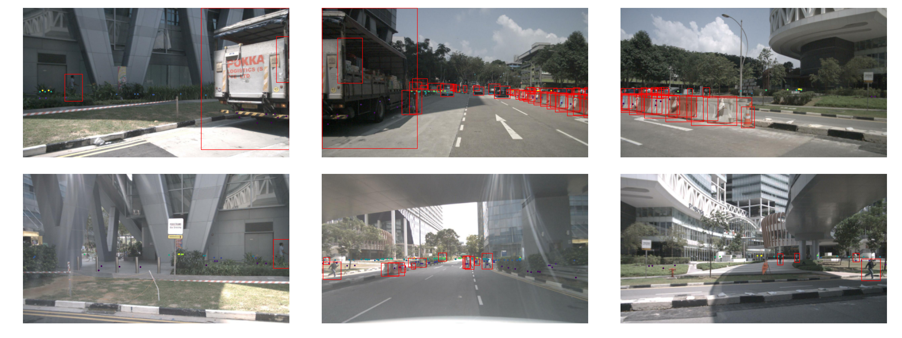
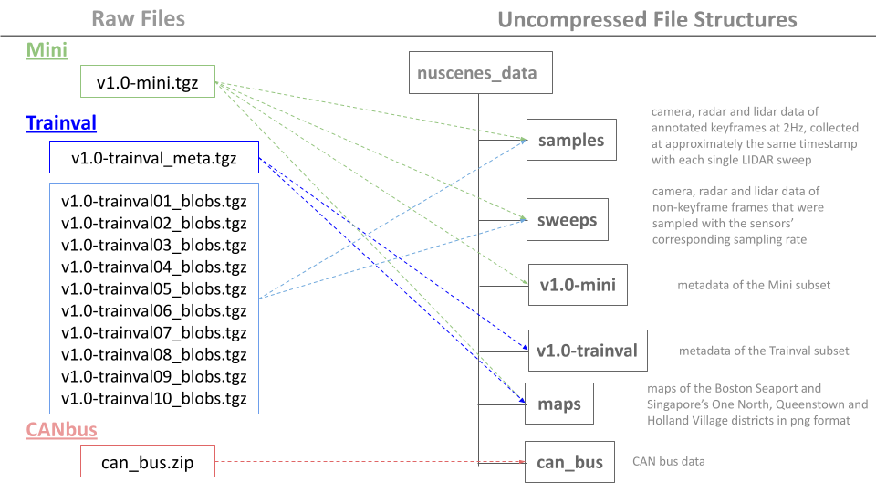

# PyTorch Dataloader of nuScenes for Image Depth Prediction
## Project Objectives
The main goal is to provide a PyTorch dataset of nuScenes to facilitate the model training of unsupervised monocular depth prediction models, including [monodepth2](https://github.com/nianticlabs/monodepth2) and [depth from videos in the wild](https://github.com/bolianchen/pytorch_depth_from_videos_in_the_wild). 
- Fused radar and lidar data are provided for sparse supervision design to enhance the performance of unsupervised models.
- A scenes viewing functionality is also available to visually inspect the camera images fused with radar or lidar data in one or multiple scenes at a time.

<ins>**Scene-0757-radar**</ins>

  

<ins>**Scene-0103-lidar**</ins>

  

<ins>**Scene-0061-radar-multi-camera-view**</ins>

  

## Download the nuScenes Dataset
- Go to [the offical page](https://www.nuscenes.org/nuscenes#download) to download either the Mini subset or the Trainval subset.
- Create a folder named "nuscenes_data" and uncompress the downloaded files into it to ensure the file structure as shown:

  

