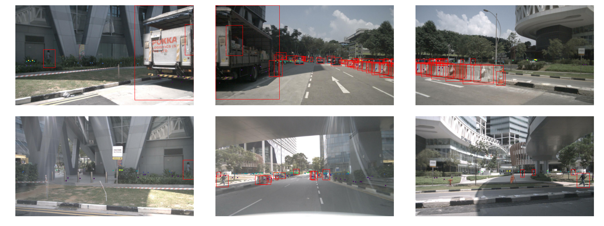
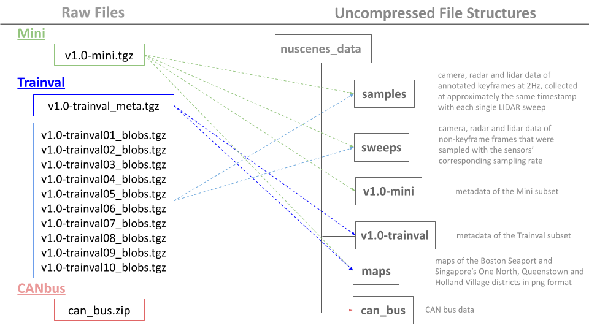

# PyTorch Dataloader of nuScenes for Image Depth Prediction
## Project Objective
The main goal is to provide a PyTorch dataset of nuScenes to facilitate the model training of unsupervised monocular depth prediction models, including [monodepth2](https://github.com/bolianchen/monodepth2_on_nuscenes) and [depth from videos in the wild](https://github.com/bolianchen/pytorch_depth_from_videos_in_the_wild). 
- Each data is composed of consecutive camera frames sampled with 12Hz.
- Radar and lidar data with the closest timestamps are fused with each camera frame for sparse supervision design, which may enhance the performance of unsupervised models.
- A scenes-viewing functionality is available to visaulize fused sensor data of the specified scenes in animation.

## Scenes-viewing Functionality
<ins>**Scene-0757-radar**</ins>
<p align="center">
  
</p>

<ins>**Scene-0103-lidar**</ins>
<p align="center">
  
</p>

<ins>**Scene-0061-radar-multi-camera-view**</ins>
<p align="center">
  
</p>

## Download the nuScenes Dataset
- Go to [the offical page](https://www.nuscenes.org/nuscenes#download) to download either the Mini subset or the Trainval subset. 
- For the Trainval subset, this repository should work for any subset of the 10 trainval blobs. (not required to download all)
- CAN bus expansion data is needed to filter images with lower and upper speed bounds.
- Create a folder named "nuscenes_data" and uncompress the downloaded files into it to ensure the file structure as shown:
<p align="center">
  
</p>

## Environment Setup
A [conda environment](https://docs.conda.io/projects/conda/en/latest/user-guide/tasks/manage-environments.html#creating-an-environment-with-commands) is recommended:
```
conda install pytorch==1.7.1 torchvision==0.8.2 torchaudio==0.7.2 -c pytorch
conda install --file requirements.txt
pip install nuscenes-devkit
```
## How to Use
Please try to find examples in [the testing scripts](https://github.com/bolianchen/nuscenes_depth/tree/main/testing) or check [the option files](https://github.com/bolianchen/nuscenes_depth/tree/main/options).  
Feel free to create new issues for any questions.
## Training of Unsupervised Depth Prediction Models
- [Monodepth2](https://github.com/bolianchen/monodepth2_on_nuscenes_cityscapes)
